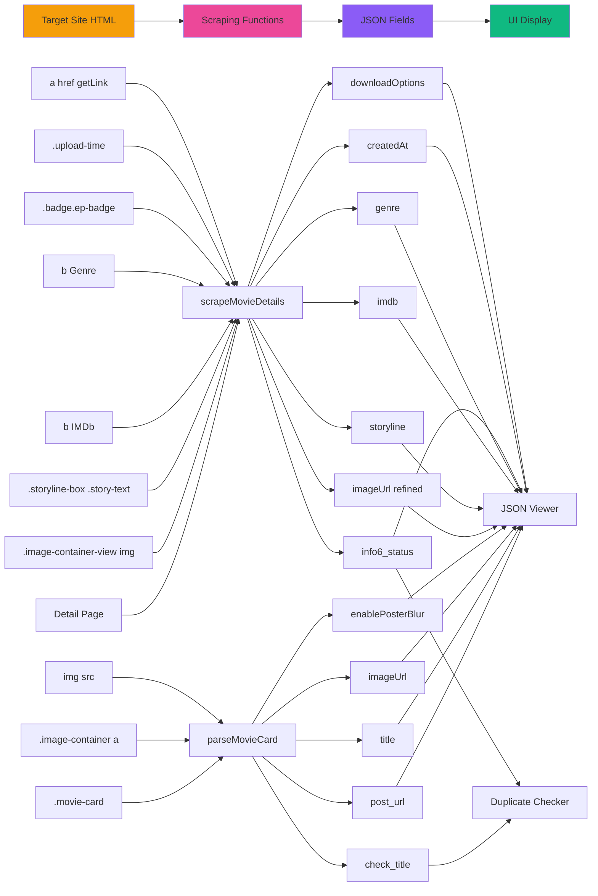

# Element Mapping Documentation

## Target Site Elements → JSON Fields → UI Display

এই ডকুমেন্টে target website এর HTML elements থেকে JSON fields এ data কিভাবে map হয় তা বিস্তারিত বর্ণনা করা হয়েছে।

---

## Listing Page Elements

### Movie Card Container
**Target Element**: `.movie-card`, `.post`, `article`, `.item-list`
**Function**: `scrapePage()` line 1952
**Purpose**: Individual movie/series card wrapper

### Adult Content Badge
**Target Element**: `.badge.adult18plus-badge`
**Function**: `parseMovieCard()` line 1717
**Maps to JSON**: `enablePosterBlur` (boolean)
**Logic**: 
- Found → `true`
- Not found → `false`

### Movie Link
**Target Element**: `.image-container a[href]`
**Function**: `parseMovieCard()` line 1722
**Maps to JSON**: `post_url`
**Processing**: `resolveUrl()` converts to absolute URL

### Movie Title (Multiple Sources)
**Target Elements**:
1. Link text: `a[href]` → `textContent`
2. Link title: `a[href]` → `title` attribute
3. Heading: `.mb-2.font-bold`, `.card-title`, `.title`, `h3`, `h2`
4. Image alt: `img` → `alt` attribute
5. Image title: `img` → `title` attribute

**Function**: `parseMovieCard()` lines 1728-1742
**Maps to JSON**:
- `title`: Cleanest/shortest version
- `check_title`: Longest/most detailed version

### Poster Image
**Target Element**: `img[src]`
**Function**: `parseMovieCard()` line 1744
**Maps to JSON**: `imageUrl` (from listing page)
**Processing**: `resolveUrl()` converts to absolute URL

---

## Detail Page Elements

### Main Poster Image
**Target Element**: `.image-container-view img[src]`
**Function**: `scrapeMovieDetails()` lines 1770-1772
**Maps to JSON**: `imageUrl` (higher quality from detail page)
**Processing**: `resolveUrl()` converts to absolute URL
**Used In**: Movie poster display in UI

### Detail Page Title
**Target Elements**:
- `.mb-2.font-bold.text-center.text-xl`
- `h1`
- `.post-title`
- `.md\\:text-3xl`
- `.lg\\:text-4xl`
- `.entry-title`

**Function**: `scrapeMovieDetails()` line 1775
**Maps to JSON**: 
- `title` (refined)
- `check_title` (if longer than listing title)

### Screenshots Gallery
**Target Element**: `.screenshot-wrapper [data-src]`
**Attribute**: `data-src`
**Function**: `scrapeMovieDetails()` lines 1786-1790
**Maps to JSON**: `screenshotLinks` (array)
**Processing**: Each `data-src` → absolute URL → array
**Used In**: Screenshot gallery display

### Storyline/Plot
**Target Element**: `.storyline-box.mt-2 .story-text`
**Function**: `scrapeMovieDetails()` line 1793
**Maps to JSON**: `storyline`
**Processing**: Trim + normalize whitespace
**Used In**: Plot description display

### Type Badge
**Target Elements** (priority order):
1. `<b class="text-orange">{value}</b>`
2. `<b>Type:</b> {value}`

**Function**: `scrapeMovieDetails()` lines 1796-1798
**Maps to JSON**: `info4_type`
**Default**: `"Movie"`
**Used In**: 
- Type classification
- ID generation prefix
- Filtering

### Info Section Fields
**Pattern**: `<b>{Label}:</b> {Value}` or `<strong>{Label}:</strong> {Value}`
**Function**: `extractInfoValue(html, label)` lines 1644-1649

#### IMDb Rating
**Pattern**: `<b>IMDb:</b> {value}`
**Maps to JSON**: `imdb`
**Example**: `"8.5/10"`
**Used In**: Rating display

#### Genre
**Pattern**: `<b>Genre:</b> {value}`
**Maps to JSON**: `genre`
**Example**: `"Action, Thriller"`
**Used In**: Genre tags, filtering

#### Language (Raw)
**Pattern**: `<b>Language:</b> {value}`
**Maps to JSON**: 
- `language_info` (raw value)
- `info3_language` (normalized via `normalizeLanguage()`)
**Processing**:
- Replace "Dual" → "Dual Audio"
- Convert `[]` and `–` → `,`
- Clean multiple commas
**Example**: `"[Hindi – English]"` → `"Hindi, English"`
**Used In**: Language display

#### Quality
**Pattern**: `<b>Quality:</b> {value}`
**Maps to JSON**: `info2_quality`
**Example**: `"BluRay"`, `"WEB-DL"`
**Used In**: Quality badge

#### Resolution
**Pattern**: `<b>Resolution:</b> {value}`
**Maps to JSON**: `resolution`
**Example**: `"1080p"`, `"720p"`
**Used In**: Resolution display

#### Released Year
**Pattern**: `<b>Released:</b> {value}`
**Maps to JSON**: `released`
**Example**: `"2024"`
**Used In**: Release year display

#### Cast
**Pattern**: `<b>Cast:</b> {value}`
**Maps to JSON**: `cast`
**Example**: `"Tom Hanks, Morgan Freeman"`
**Used In**: Cast information display

### Status Badge
**Target Elements** (scoped to content area):
**Scope**: `.data`, `.sheader`, `.extra`, `.mvic-desc`, or `body`
**Selectors** (priority order):
1. `.badge.ep-badge.added`
2. `.badge.ep-badge`
3. `.badge.status`

**Function**: `scrapeMovieDetails()` lines 1814-1823
**Maps to JSON**: `info6_status`
**Default**: `"Online"`
**Processing**: Normalize whitespace
**Examples**:
- `"Online"`
- `"HD"`
- `"S01 | Ep 1-9 Added"`
- `"Completed"`
**Used In**:
- Status display
- Duplicate detection (with season/episode logic)
- Update detection

### Upload Time
**Target Element**: `.upload-time`
**Function**: `scrapeMovieDetails()` lines 1826-1828
**Maps to JSON**: 
- `createdAt` (ISO timestamp)
- `lastUpdated` (same value)
**Processing**: `parseUploadTime()` function
**Patterns Supported**:
- "X seconds ago"
- "X minutes ago"
- "X hours ago"
- "X days ago"
- "X weeks ago"
- "X months ago"
- "X years ago"
**Output**: ISO 8601 timestamp
**Example**: `"2 hours ago"` → `"2024-02-03T13:43:00.000Z"`
**Used In**: Timestamp display

### Download Links
**Target Elements**:
1. `.d-flex.justify-content-center.align-items-center.my-2 .d-flex.flex-wrap.justify-content-center.align-items-center.gap-2.gap-md-3.my-2 a[href*="/getLink/"]`
2. `.card.h-100.border-left-success.shadow-sm.position-relative .mb-2.d-flex.justify-content-center a[href*="/getLink/"]`

**Function**: `scrapeMovieDetails()` lines 1833-1850
**Text Pattern**: `Download [{quality} • {size}]`
**Example**: `"Download [1080p • 2.5 GB]"`

**Extraction**:
```javascript
Regex: /Download\s*\[(.*)\s*•\s*(.*)\]/i
Group 1: quality → "1080p"
Group 2: size → "2.5 GB"
href attribute → download URL
```

**Maps to JSON**: `downloadOptions[0].qualities[]`
```json
{
  "quality_text": "1080p",
  "path": "https://example.com/getLink/abc123",
  "file_size": "2.5 GB"
}
```
**Used In**: Download buttons in UI

---

## JSON to UI Display Mapping

### Live JSON Viewer
**Element**: `#jsonViewer` (line 1042)
**Source**: `state.scrapedData` or `state.newScrapedData`
**Function**: `updateJsonViewer()` lines 1261-1265
**Display**: Formatted JSON with syntax highlighting

### Status Panel
**Elements**:
- `#statusText` → Current scraping status
- `#currentPage` → Current page number
- `#cardsScraped` → Total cards scraped
- `#duplicatesSkipped` → Duplicate count
- `#runningTime` → Elapsed time

**Updated By**: Various functions during scraping

### Duplicate Tracker
**Element**: `#duplicateList` (line 1003)
**Source**: `state.detectedDuplicates`
**Function**: `addDuplicateToUI()` lines 1608-1639
**Display**: List of duplicate items with tags
**Tags**:
- `<span class="duplicate-tag">Duplicate</span>`
- `<span class="update-tag">Updated: {status}</span>`

### Progress Bar
**Element**: `#progressFill` (line 991)
**Function**: `updateProgress()` lines 1267-1271
**Calculation**: `(current / total) * 100`
**Display**: Animated gradient bar

### Log Container
**Element**: `#logContainer` (line 994)
**Function**: `log(message, type)` lines 1244-1254
**Types**:
- `log-info` (blue)
- `log-success` (green)
- `log-warning` (yellow)
- `log-error` (red)
**Display**: Last 10 log messages

---

## Complete Element Flow Diagram



---

## Summary Table: Element → JSON → UI

| Target Element | Selector/Pattern | JSON Field | UI Display |
|----------------|------------------|------------|------------|
| Movie card | `.movie-card` | - | - |
| Adult badge | `.badge.adult18plus-badge` | `enablePosterBlur` | JSON viewer |
| Movie link | `.image-container a[href]` | `post_url` | JSON viewer |
| Card title | `.mb-2.font-bold` | `title`, `check_title` | JSON viewer, Duplicate UI |
| Card image | `img[src]` | `imageUrl` | JSON viewer |
| Detail image | `.image-container-view img` | `imageUrl` | JSON viewer |
| Detail title | `h1`, `.post-title` | `title`, `check_title` | JSON viewer |
| Screenshots | `.screenshot-wrapper [data-src]` | `screenshotLinks[]` | JSON viewer |
| Storyline | `.storyline-box .story-text` | `storyline` | JSON viewer |
| Type badge | `<b class="text-orange">` | `info4_type` | JSON viewer |
| IMDb | `<b>IMDb:</b>` | `imdb` | JSON viewer |
| Genre | `<b>Genre:</b>` | `genre` | JSON viewer |
| Language | `<b>Language:</b>` | `language_info`, `info3_language` | JSON viewer |
| Quality | `<b>Quality:</b>` | `info2_quality` | JSON viewer |
| Resolution | `<b>Resolution:</b>` | `resolution` | JSON viewer |
| Released | `<b>Released:</b>` | `released` | JSON viewer |
| Cast | `<b>Cast:</b>` | `cast` | JSON viewer |
| Status badge | `.badge.ep-badge.added` | `info6_status` | JSON viewer, Duplicate UI |
| Upload time | `.upload-time` | `createdAt`, `lastUpdated` | JSON viewer |
| Download links | `a[href*="/getLink/"]` | `downloadOptions[].qualities[]` | JSON viewer |

---

## Processing Functions Reference

| Function | Purpose | Input | Output |
|----------|---------|-------|--------|
| `parseMovieCard()` | Extract card data | Card HTML | `{href, title, check_title, imageUrl, enablePosterBlur}` |
| `scrapeMovieDetails()` | Extract detail data | Movie URL | Complete movie object |
| `extractInfoValue()` | Extract info field | HTML + label | Field value |
| `cleanMovieTitle()` | Normalize title | Raw title | Cleaned title |
| `normalizeLanguage()` | Normalize language | Raw language | Normalized language |
| `parseUploadTime()` | Parse time text | "X ago" text | ISO timestamp |
| `resolveUrl()` | Make absolute URL | Base + relative | Absolute URL |
| `generateNextId()` | Create unique ID | Type | Unique ID string |
| `findExistingMovie()` | Check duplicate | Movie object | Existing movie or null |
