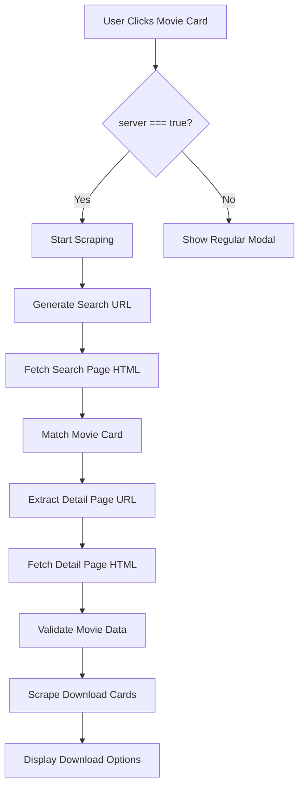

# 🎬 Movie Scraper System - সম্পূর্ণ ডকুমেন্টেশন

## 📋 সূচিপত্র
1. [JSON ফিল্ড ম্যাপিং](#json-field-mapping)
2. [Scraping Workflow](#scraping-workflow)
3. [Target Site Elements](#target-site-elements)
4. [আপনার সাইটের Elements](#your-site-elements)
5. [Data Flow Diagram](#data-flow-diagram)

---

## 🗂️ JSON ফিল্ড ম্যাপিং {#json-field-mapping}

### Movie JSON Structure

আপনার সাইটে প্রতিটি মুভির জন্য নিম্নলিখিত JSON ফিল্ড ব্যবহার করা হয়:

```json
{
  "id": "unique-movie-id",
  "title": "Movie Title (2024)",
  "imageUrl": "https://example.com/poster.jpg",
  "screenshotLinks": ["url1", "url2", "url3"],
  "type": "Movie",
  "genre": "Action, Drama",
  "language": "Dual [Hindi-Tamil]",
  "quality": "WEB-DL",
  "resolution": "1080p",
  "released": "2024",
  "cast": "Actor 1, Actor 2",
  "storyline": "Movie description...",
  "imdb": "8.5",
  "server": true
}
```

### ফিল্ড ব্যবহার বিস্তারিত

| JSON Field | Target Element (আপনার সাইট) | Description |
|------------|---------------------------|-------------|
| `id` | `.movie-card[data-id]` | Movie card এর unique identifier |
| `title` | `.movie-title` | Movie এর নাম |
| `imageUrl` | `.movie-poster img[src]` | Poster image URL |
| `screenshotLinks` | `#screenshotsWrapper .swiper-slide img` | Screenshot gallery |
| `type` | `#modalTypeValue`, `.info-value.type-value` | Movie/Series type |
| `genre` | `#modalGenre`, `.detail-value` | Genre তথ্য |
| `language` | `#modalLanguageValue`, `#modalLanguageDetail` | ভাষা তথ্য |
| `quality` | `#modalQualityValue`, `#modalQualityDetail` | Video quality |
| `resolution` | `#modalResolution` | Screen resolution |
| `released` | `#modalReleased` | Release year |
| `cast` | `#modalCast` | Cast members |
| `storyline` | `#modalStoryline` | Movie description |
| `imdb` | `#modalIMDb` | IMDb rating |
| `server` | N/A (Logic flag) | `true` হলে scraping চালু হবে |

---

## 🔄 Scraping Workflow {#scraping-workflow}

### Step-by-Step Process



### 1️⃣ **Initialization Phase**

**File:** [`scraper-integration.js`](file:///c:/Users/DM%20Expert%20Saim/Desktop/Doc%20of%20my%20site/scraper-integration.js)

- **Line 34-42:** Configuration লোড করা হয়
- **Line 72-98:** Event listeners setup করা হয়
- **Line 101-133:** Movie poster click handler

```javascript
// Configuration
this.config = {
    baseScrapingURL: 'https://mlink627.movielinkbd.li',
    useCORSProxy: true,
    debug: true
};
```

### 2️⃣ **Search Phase**

**File:** [`scraper-engine.js`](file:///c:/Users/DM%20Expert%20Saim/Desktop/Doc%20of%20my%20site/scraper-engine.js)

**Line 46-65:** URL Generation
```javascript
generateSearchURL(title) {
    const cleanTitle = title.replace(/\s*\(\d{4}\)\s*/g, ' ').trim();
    params.append('s', cleanTitle);
    return `${this.baseScrapingURL}/?${params.toString()}`;
}
```

**Line 104-195:** HTML Fetching with CORS Proxy
- Multiple proxy support (CorsProxy, CodeTabs, AllOrigins)
- Automatic fallback mechanism
- 5 second timeout per proxy

### 3️⃣ **Matching Phase**

**Line 227-298:** Search Result Matching

Target site থেকে এই elements খোঁজা হয়:
- `div.movie-card`
- `.title`, `h2`, `h3`, `a` (title extraction)
- `a[href]` (detail page link)

### 4️⃣ **Validation Phase**

**Line 312-357:** Detail Page Validation

Scraped data vs JSON data comparison:
- Image URL check
- Info-line data extraction (type, genre, resolution, etc.)

### 5️⃣ **Content Scraping Phase**

**Line 424-490:** Instruction Section Scraping
**Line 503-564:** Guide Section Scraping
**Line 578-850:** Download Cards Scraping

---

## 🎯 Target Site Elements {#target-site-elements}

### Scraping করা হয় যে elements থেকে:

#### 1. **Search Results Page**

| Element | Purpose | Scraped Data |
|---------|---------|--------------|
| `div.movie-card` | Movie container | Full card structure |
| `.title`, `h2`, `h3` | Movie title | Title matching |
| `a[href]` | Detail page link | Navigation URL |

#### 2. **Detail Page - Movie Info**

| Element | Purpose | Scraped Data |
|---------|---------|--------------|
| `.image-container-view img` | Poster image | Image URL validation |
| `.screenshot-wrapper [data-src]` | Screenshots | Screenshot URLs |
| `.storyline-box .story-text` | Storyline | Movie description |
| `.info-line` | Movie metadata | Type, Genre, Resolution, Cast |

**Info-line Regex Patterns:**
```javascript
Type:\s*(.+?)(?:\||$)
Genre:\s*(.+?)(?:\||$)
Resolution:\s*(.+?)(?:\||$)
Released:\s*(.+?)(?:\||$)
Cast:\s*(.+?)(?:\||$)
```

#### 3. **Detail Page - Instructions**

| Element | Purpose | Scraped Data |
|---------|---------|--------------|
| `div.text-md.border-bottom-dark...` | Instruction container | Full section |
| `h3.text-success.font-weight-bold` | Header text | Main heading |
| `h5.text-warning` | Sub-header | Warning text |
| `span.mlbd-note-attn` | Attention notice | Important notes |
| `div[style*="color:#ff5b6b"]` | Red notice | Critical warnings |
| `div[style*="color:#ffc107"]` | Yellow notice | General warnings |
| `div.text-center.fw-bold.text-info` | Unzip guide | Guide link |

#### 4. **Detail Page - Download Cards**

**Strategy 1: Episode Cards**
```html
<div class="col-md-4 col-sm-6 mb-4 ep-card">
    <h5 class="ep-card-title">Episode 1</h5>
    <a href="/getLink/123">
        <span class="btn-text">Download [720p • 443 MB]</span>
    </a>
</div>
```

**Strategy 2: Flex Container**
```html
<div class="d-flex flex-wrap justify-content-center...">
    <a href="/getLink/456">
        <span class="btn-text">1080p</span>
    </a>
</div>
```

**Strategy 3: Default Cards**
```html
<div class="card border-left-success">
    <h5 class="mb-3">Download Options</h5>
    <div class="mb-2 d-flex justify-content-center">
        <a href="/getLink/789">Download</a>
    </div>
</div>
```

### Quality & Size Parsing

**Regex Patterns Used:**
```javascript
// Quality patterns
/(\d{3,4}p)/i          // 720p, 1080p, 480p
/4K|UHD/i              // 4K, UHD
/HD|SD/i               // HD, SD
/WEB-?DL/i             // WEB-DL
/BluRay|Blu-ray/i      // BluRay

// Size patterns
/(\d+(?:\.\d+)?)\s*(GB|MB|KB)/i  // 1.5 GB, 443 MB
```

---

## 🏠 আপনার সাইটের Elements {#your-site-elements}

### HTML Structure

#### 1. **Movie Card** ([`index.html`](file:///c:/Users/DM%20Expert%20Saim/Desktop/Doc%20of%20my%20site/index.html#L242-L247))

```html
<div class="movies-grid" id="moviesGrid">
    <div class="movie-card" data-id="123">
        
        <h3 class="movie-title">Movie Title (2024)</h3>
    </div>
</div>
```

**CSS:** [styles.css:L798-L900](file:///c:/Users/DM%20Expert%20Saim/Desktop/Doc%20of%20my%20site/styles.css#L798-L900)

#### 2. **Movie Modal** ([`index.html`](file:///c:/Users/DM%20Expert%20Saim/Desktop/Doc%20of%20my%20site/index.html#L367-L479))

**Header Section:**
```html
<div class="movie-header">
    <h1 id="modalMovieTitle">Movie Title</h1>
    <p id="modalMovieSubtitle">WEB-DL | Movie</p>
    
    <div class="info-row">
        <span id="modalTypeValue">Movie</span>
        <span id="modalLanguageValue">Dual [Hindi-Tamil]</span>
        <span id="modalQualityValue">WEB-DL</span>
    </div>
</div>
```

**Screenshots Section:**
```html
<div id="screenshotsSection">
    <div class="swiper" id="screenshotsSwiper">
        <div class="swiper-wrapper" id="screenshotsWrapper">
            <!-- Screenshots loaded here -->
        </div>
    </div>
</div>
```

**Details Card:**
```html
<div class="details-card">
    <div class="details-list">
        <div class="detail-item">
            <span id="modalIMDb">8.5</span>
        </div>
        <div class="detail-item">
            <span id="modalGenre">Action, Drama</span>
        </div>
        <div class="detail-item">
            <span id="modalLanguageDetail">Hindi</span>
        </div>
        <div class="detail-item">
            <span id="modalQualityDetail">WEB-DL</span>
        </div>
        <div class="detail-item">
            <span id="modalResolution">1080p</span>
        </div>
        <div class="detail-item">
            <span id="modalReleased">2024</span>
        </div>
        <div class="detail-item">
            <span id="modalCast">Actor 1, Actor 2</span>
        </div>
    </div>
    
    <div class="storyline-section">
        <p id="modalStoryline">Movie description...</p>
    </div>
</div>
```

#### 3. **Scraped Content Sections** ([`index.html`](file:///c:/Users/DM%20Expert%20Saim/Desktop/Doc%20of%20my%20site/index.html#L464-L465))

```html
<!-- Instruction Section -->
<div id="instructionSection" class="scraped-content-section"></div>

<!-- Guide Section -->
<div id="guideSection" class="scraped-content-section"></div>
```

**Injected by:** [`scraper-integration.js:L236-L279`](file:///c:/Users/DM%20Expert%20Saim/Desktop/Doc%20of%20my%20site/scraper-integration.js#L236-L279)

#### 4. **Download Options** ([`index.html`](file:///c:/Users/DM%20Expert%20Saim/Desktop/Doc%20of%20my%20site/index.html#L468-L476))

```html
<div class="download-section">
    <h4 class="section-subtitle">
        <i class="fas fa-download"></i>
        <span id="downloadTitle">Download Options</span>
    </h4>
    <div class="download-options" id="downloadOptions">
        <!-- Download cards injected here -->
    </div>
</div>
```

**Injected Structure:**
```html
<div class="download-server animate-fade-in">
    <div class="server-title">
        <div class="server-info">
            <i class="fas fa-play-circle"></i>
            <span>Episode 1</span>
        </div>
        <span class="new-badge">NEW ADDED</span>
    </div>
    
    <div class="quality-options">
        <button class="quality-btn scraped-download-btn" 
                onclick="scraperIntegration.handleDownloadClick(...)">
            <div class="quality-info">
                <span class="quality-text">1080p</span>
                <span class="file-size">Size: 2.5 GB</span>
            </div>
            <i class="fas fa-download"></i>
        </button>
    </div>
</div>
```

**CSS:** [styles.css:L2500-L2700](file:///c:/Users/DM%20Expert%20Saim/Desktop/Doc%20of%20my%20site/styles.css#L2500-L2700)

#### 5. **Scraper Dialog** (Dynamically Created)

**Created by:** [`scraper-integration.js:L691-L718`](file:///c:/Users/DM%20Expert%20Saim/Desktop/Doc%20of%20my%20site/scraper-integration.js#L691-L718)

```html
<div id="scraperDialogOverlay" class="scraper-dialog-overlay">
    <div class="scraper-dialog-content">
        <div class="scraper-dialog-header">
            <h3>Download Option</h3>
            <button class="scraper-dialog-close">×</button>
        </div>
        <div class="scraper-dialog-body" id="scraperDialogBody">
            <!-- Dynamic content -->
        </div>
    </div>
</div>
```

---

## 📊 Data Flow Diagram {#data-flow-diagram}

### Complete Flow

```
┌─────────────────────────────────────────────────────────────┐
│                    1. USER INTERACTION                       │
└─────────────────────────────────────────────────────────────┘
                              │
                              ▼
                    User clicks .movie-card
                              │
                              ▼
┌─────────────────────────────────────────────────────────────┐
│                  2. JSON DATA RETRIEVAL                      │
│  File: scraper-integration.js (Line 214-221)                │
│  Function: getMovieData(movieId)                            │
└─────────────────────────────────────────────────────────────┘
                              │
                              ▼
                    Check: server === true?
                              │
                    ┌─────────┴─────────┐
                    │                   │
                   Yes                 No
                    │                   │
                    ▼                   ▼
        Start Scraping          Show Regular Modal
                    │
                    ▼
┌─────────────────────────────────────────────────────────────┐
│                  3. URL GENERATION                           │
│  File: scraper-engine.js (Line 46-65)                       │
│  Input: title = "Movie Name (2024)"                         │
│  Output: "https://target.site/?s=Movie+Name"                │
└─────────────────────────────────────────────────────────────┘
                              │
                              ▼
┌─────────────────────────────────────────────────────────────┐
│                  4. HTML FETCHING                            │
│  File: scraper-engine.js (Line 104-195)                     │
│  Proxies: CorsProxy → CodeTabs → AllOrigins                 │
│  Timeout: 5 seconds per proxy                               │
└─────────────────────────────────────────────────────────────┘
                              │
                              ▼
┌─────────────────────────────────────────────────────────────┐
│                  5. SEARCH MATCHING                          │
│  File: scraper-engine.js (Line 227-298)                     │
│  Target Elements:                                            │
│    - div.movie-card                                          │
│    - .title, h2, h3                                          │
│    - a[href] → Detail Page URL                              │
└─────────────────────────────────────────────────────────────┘
                              │
                              ▼
┌─────────────────────────────────────────────────────────────┐
│                  6. DETAIL PAGE FETCH                        │
│  Fetch HTML from Detail Page URL                            │
└─────────────────────────────────────────────────────────────┘
                              │
                              ▼
┌─────────────────────────────────────────────────────────────┐
│                  7. CONTENT EXTRACTION                       │
│  ┌───────────────────────────────────────────────────────┐  │
│  │ A. Instruction Section (Line 424-490)                │  │
│  │    Target: div.text-md.border-bottom-dark...         │  │
│  │    Extract: h3, h5, notices, unzip guide            │  │
│  │    Inject to: #instructionSection                    │  │
│  └───────────────────────────────────────────────────────┘  │
│                              │                               │
│  ┌───────────────────────────────────────────────────────┐  │
│  │ B. Guide Section (Line 503-564)                      │  │
│  │    Target: h3.text-success, h4.text-warning          │  │
│  │    Extract: headers, guides, VLC link               │  │
│  │    Inject to: #guideSection                          │  │
│  └───────────────────────────────────────────────────────┘  │
│                              │                               │
│  ┌───────────────────────────────────────────────────────┐  │
│  │ C. Download Cards (Line 578-850)                     │  │
│  │    Strategy 1: div.ep-card                           │  │
│  │    Strategy 2: div.d-flex.flex-wrap...               │  │
│  │    Strategy 3: div.card.border-left-success          │  │
│  │    Extract: header, quality, size, href              │  │
│  │    Inject to: #downloadOptions                       │  │
│  └───────────────────────────────────────────────────────┘  │
└─────────────────────────────────────────────────────────────┘
                              │
                              ▼
┌─────────────────────────────────────────────────────────────┐
│                  8. UI INJECTION                             │
│  File: scraper-integration.js                               │
│  - injectInstructionSection() (Line 236-279)                │
│  - injectGuideSection() (Line 281-325)                      │
│  - appendDownloadOption() (Line 327-369)                    │
└─────────────────────────────────────────────────────────────┘
                              │
                              ▼
┌─────────────────────────────────────────────────────────────┐
│                  9. DOWNLOAD HANDLING                        │
│  User clicks download button                                │
│  → handleDownloadClick() (Line 381-510)                     │
│  → Check unlock status                                       │
│  → Show ads if locked                                        │
│  → Scrape final download link                               │
│  → Open in new tab                                           │
└─────────────────────────────────────────────────────────────┘
```

---

## 🔗 Element Mapping Summary

### JSON → Target Site → Your Site

| Data | JSON Field | Target Site Element | Your Site Element | Injected By |
|------|-----------|-------------------|------------------|-------------|
| **Movie Title** | `title` | `div.movie-card .title` | `#modalMovieTitle` | Main app logic |
| **Poster** | `imageUrl` | `.image-container-view img` | `.movie-poster` | Main app logic |
| **Screenshots** | `screenshotLinks` | `.screenshot-wrapper [data-src]` | `#screenshotsWrapper` | Main app logic |
| **Type** | `type` | `.info-line` (regex) | `#modalTypeValue` | Main app logic |
| **Genre** | `genre` | `.info-line` (regex) | `#modalGenre` | Main app logic |
| **Language** | `language` | `.info-line` (regex) | `#modalLanguageValue` | Main app logic |
| **Quality** | `quality` | `.info-line` (regex) | `#modalQualityValue` | Main app logic |
| **Resolution** | `resolution` | `.info-line` (regex) | `#modalResolution` | Main app logic |
| **Released** | `released` | `.info-line` (regex) | `#modalReleased` | Main app logic |
| **Cast** | `cast` | `.info-line` (regex) | `#modalCast` | Main app logic |
| **Storyline** | `storyline` | `.storyline-box .story-text` | `#modalStoryline` | Main app logic |
| **IMDb** | `imdb` | N/A | `#modalIMDb` | Main app logic |
| **Instructions** | N/A (scraped) | `div.text-md.border-bottom-dark...` | `#instructionSection` | `injectInstructionSection()` |
| **Guide** | N/A (scraped) | `h3.text-success`, `h4.text-warning` | `#guideSection` | `injectGuideSection()` |
| **Download Options** | N/A (scraped) | `div.ep-card`, `div.card` | `#downloadOptions` | `appendDownloadOption()` |

---

## 🎨 CSS Classes Used

### Scraped Content Styling

**File:** [`styles.css`](file:///c:/Users/DM%20Expert%20Saim/Desktop/Doc%20of%20my%20site/styles.css)

| Class | Purpose | Used In |
|-------|---------|---------|
| `.scraped-content-section` | Container for scraped sections | `#instructionSection`, `#guideSection` |
| `.download-server` | Download card container | Injected download options |
| `.server-title` | Card header | Download card |
| `.quality-options` | Quality buttons container | Download card |
| `.quality-btn` | Individual quality button | Download card |
| `.scraped-download-btn` | Download button specific class | Download card |
| `.new-badge` | "NEW ADDED" indicator | Download card |
| `.notice-item` | Notice/instruction row | Instruction/Guide sections |
| `.notice-icon` | Icon for notices | Instruction/Guide sections |
| `.notice-text` | Text for notices | Instruction/Guide sections |
| `.scraper-dialog-overlay` | Dialog background | Scraper dialog |
| `.scraper-dialog-content` | Dialog box | Scraper dialog |
| `.scraper-loading-state` | Loading indicator | Scraper dialog |
| `.scraper-success-state` | Success message | Scraper dialog |

---

## 🚀 Key Functions Reference

### scraper-engine.js

| Function | Line | Purpose |
|----------|------|---------|
| `generateSearchURL()` | 46-65 | Create search URL from title |
| `fetchHTML()` | 104-195 | Fetch HTML with CORS proxy |
| `parseHTML()` | 202-213 | Parse HTML string to DOM |
| `matchSearchResults()` | 227-298 | Find matching movie in search |
| `validateDetailPage()` | 312-357 | Validate scraped data |
| `scrapeInstructionSection()` | 424-490 | Extract instruction content |
| `scrapeGuideSection()` | 503-564 | Extract guide content |
| `scrapeDownloadCards()` | 578-850 | Extract download options |
| `parseQualityAndSize()` | 852-950 | Parse quality/size from text |
| `handleOneClickDownload()` | 952-1100 | Process download link |

### scraper-integration.js

| Function | Line | Purpose |
|----------|------|---------|
| `init()` | 34-42 | Initialize scraper |
| `setupEventListeners()` | 72-98 | Setup click handlers |
| `handleMoviePosterClick()` | 101-133 | Handle movie click |
| `startScraping()` | 135-212 | Start scraping process |
| `getMovieData()` | 214-221 | Get movie from JSON |
| `injectInstructionSection()` | 236-279 | Inject instructions |
| `injectGuideSection()` | 281-325 | Inject guide |
| `appendDownloadOption()` | 327-369 | Add download card |
| `handleDownloadClick()` | 381-510 | Handle download click |
| `processScraperUnlock()` | 512-664 | Process ad unlock |
| `showScraperDialog()` | 691-718 | Show dialog |
| `updateScraperDialogSuccess()` | 720-746 | Update dialog with links |

---

## 📝 Notes

### Important Considerations

1. **CORS Proxy**: Multiple proxies used for reliability
2. **Caching**: HTML responses cached to avoid redundant requests
3. **Validation**: Loose validation to handle variations
4. **Incremental Loading**: Download options appear one by one
5. **Error Handling**: Graceful fallbacks for missing data
6. **Ad Unlock System**: Per-link unlock mechanism
7. **Network Resilience**: Automatic retry with different proxies

### Configuration

**Base Scraping URL:** `https://mlink627.movielinkbd.li`
**CORS Proxies:**
- CorsProxy: `https://corsproxy.io/?url=`
- CodeTabs: `https://api.codetabs.com/v1/proxy?quest=`
- AllOrigins: `https://api.allorigins.win/get?url=`

---

## 🎯 Quick Reference

### যখন একটি movie card click করা হয়:

1. ✅ JSON থেকে movie data load হয়
2. ✅ `server: true` check করা হয়
3. ✅ Search URL generate হয়
4. ✅ Target site থেকে HTML fetch হয়
5. ✅ Movie card match করা হয়
6. ✅ Detail page URL extract হয়
7. ✅ Detail page HTML fetch হয়
8. ✅ Instruction section scrape হয়
9. ✅ Guide section scrape হয়
10. ✅ Download cards scrape হয়
11. ✅ আপনার সাইটে inject হয়

### যখন download button click করা হয়:

1. ✅ Unlock status check হয়
2. ✅ Locked হলে ad system চালু হয়
3. ✅ Unlocked হলে deep scraping শুরু হয়
4. ✅ Final download link extract হয়
5. ✅ New tab এ open হয়

---

**Documentation Version:** 1.0  
**Last Updated:** 2026-02-03  
**Created by:** Antigravity AI
